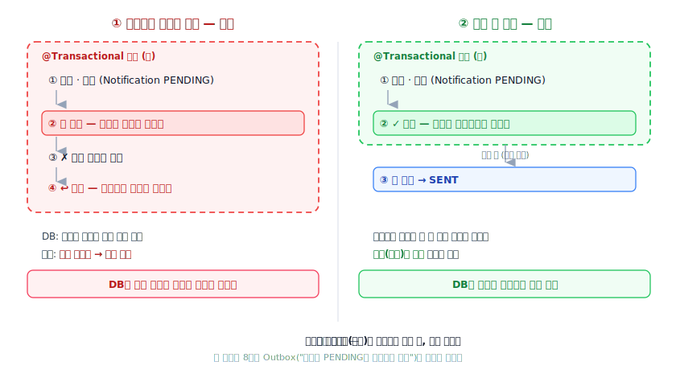

# CodeLayer

> 실무 코드 기반 선택형 학습 프레임워크 — 개발 레이어와 학습 레이어를 분리합니다.

CodeLayer는 "만들면서 배우되, 만드는 일과 배우는 일을 섞지 않는" 학습 방식입니다.
AI 어시스턴트(Claude Code 등)와 함께 실무 수준의 프로젝트를 진행하면서, 각 구현 단계가 끝날 때마다 그 코드에서 배울 것을 **직접 골라** 깊이 있게 학습합니다 — 하나하나의 **개념**을 파고들 수도, 여러 클래스가 맞물리는 **구현 흐름 자체를 직접 장악**할 수도 있습니다.

이 저장소는 CodeLayer의 **순수 골격(템플릿)** 입니다. 학습하고 싶은 프로젝트에 이 구조를 복사해 넣으면, AI가 `INSTRUCTIONS.md`의 규칙에 따라 학습 진행자(튜터) 역할을 시작합니다.

---

## 왜 CodeLayer인가

일반적인 AI 페어 프로그래밍은 두 가지를 동시에 합니다 — 코드를 만들고, 그 자리에서 설명합니다. 이때 설명은 흐름을 끊지 않으려고 짧아지고, 코드는 학습자 수준에 맞춰 단순해지기 쉽습니다. 결과적으로 **실무 코드도, 깊은 학습도 어중간해집니다.**

CodeLayer는 이 둘을 레이어로 분리합니다.

| | 개발 레이어 | 학습 레이어 |
|---|---|---|
| 언제 | 구현 중 | 단계 완료 후 |
| 코드 수준 | 항상 실무 수준 | (원본 코드를 읽기만 함) |
| 설명 | 하지 않음 (주석 최소화) | 1대1 튜터처럼 깊이 있게 |
| 결과물 | 동작하는 프로젝트 | 단계별 학습 문서 |

구현 중에는 설명하지 않으므로 코드 품질을 타협하지 않습니다. 학습은 단계가 끝난 뒤 별도로, 학습자가 고른 개념만 충분한 깊이로 진행합니다.

---

## 핵심 동작 흐름

![CodeLayer 동작 모델. 위쪽 '개발 레이어'에서 ① 플랜을 세우고 ② 단계를 실무 코드로 구현하며 구현 일지(journal/)를 남긴다(구현 중엔 설명하지 않는다). 단계가 완료되면 아래 '학습 레이어'로 내려가 ③ 통합 개요 한 문서(overview/)에 그 단계의 학습거리를 모은다 — 개념 [N]과 구현 유닛 [U N]을 함께 싣는다. 여기서 두 갈래로 갈린다: '개념 학습'(추천 점수 = 지금 이해할 가치 → learn/개념명/의 섹션별 설명)과 '구현 장악'(장악 점수 = 직접 만들 가치 → learn/구현여정/의 구현 과정 관전). 두 점수는 다른 축이라 환산하지 않는다. 두 갈래는 ④ 평가(개념은 이해 확인, 구현은 생성·검증)로 모이고, ⑤ 프로필 갱신(전역 LEARNING_PROFILE.md)을 거쳐 다음 단계로 순환한다.](docs/assets/codelayer-flow.svg)

이 모든 절차의 정확한 규칙은 [`.codelayer/INSTRUCTIONS.md`](.codelayer/INSTRUCTIONS.md)에 정의되어 있습니다. AI는 매 세션 시작 시 이 파일과 프로필, 플랜을 읽고 동작합니다.

---

## 산출물 예시 — 실제로 이렇게 나옵니다

말보다 결과물이 빠릅니다. 아래는 실제 Spring 프로젝트(공고 수집 → 알림 생성 → **메일 발송**)의 **단계 7**을 CodeLayer로 학습하며 나온 진짜 산출물의 발췌입니다. 전체 파일 묶음은 [`examples/notification-platform-step-7/`](examples/notification-platform-step-7/)에서 열어볼 수 있습니다.

> `examples/`는 결과물을 보여주기 위한 쇼케이스일 뿐, 템플릿의 일부가 아닙니다(새 프로젝트에 복사하는 것은 `.codelayer/`·`.plan/`·`CLAUDE.md`뿐).

### ① 통합 개요 — 한 단계의 학습거리를 한눈에

단계가 끝나면 그 단계에서 배울 것을 한 문서에 펼칩니다. **개념**(`[N]` · 추천 점수 = *이해할* 가치)과 **구현 유닛**(`[U N]` · 장악 점수 = *직접 만들* 가치)을 배지·점수와 함께 한 표로 — 두 점수는 서로 다른 질문에 답하므로 환산하지 않습니다.

| # | 학습거리 | 종류 | 배지 | 점수 |
|--:|----------|:----:|:----:|:---:|
| **[2]** | 테스트더블 / `@MockitoBean` — 발송기를 가짜로 세우기 | 개념 | 🟠 정독 권장 | 74 |
| **[U1]** | 커밋 *후* 발송 **흐름 조립** (관전 진입) | 구현 유닛 | 🟠 정독+생성 | 68 |
| **[1]** | 트랜잭션 경계 *밖*의 비가역 부수효과 | 개념 | 🟠 정독 권장 | 64 |
| [U2] | `dispatchPending` — 발송·전이 | 구현 유닛 | 🟡 정독+검증 | 52 |
| [3] | 발송기 인터페이스 추상화 | 개념 | ⚪ 훑기 | 32 |

> `[2]`가 가장 높은 건 *새로 배울 토대가 비어 있어서*예요 — Mock/테스트더블이 아직 손에 익지 않은 영역이라면 그렇습니다. **점수는 "구현에서 얼마나 중요한가"가 아니라 "이 학습자가 지금 배워야 하는가"에 답합니다.**

— 전체: [`overview.md`](examples/notification-platform-step-7/overview.md) (구현 여정 요약 + 개념 5개 + 구현 유닛 2개)

### ② 개념 학습 — 한 개념을 "왜 필요한가"부터 깊게

개념을 고르면, 그 개념을 섹션별 문서로 파고듭니다. 빠른 요약이 아니라 **1대1 튜터의 목소리**로, 비유와 코드 앵커(`❶❷❸`)를 써서 씁니다.

> 지금까지 당신이 써 온 통합테스트를 잠깐 떠올려 볼게요. `@SpringBootTest`를 붙이면 스프링이 **애플리케이션 컨텍스트를 통째로 띄웁니다** (…) 그런데 단계 7에서 **발송**을 통합테스트로 검증하려는 순간, 지금까지 잘 통하던 그 "전부 진짜로 띄운다"가 처음으로 벽에 부딪힙니다.
>
> **물리적 비유.** 소방관 훈련에서 진짜 건물에 불을 지르지 않죠. 확인하고 싶은 건 "발송 *절차*가 제대로 작동하는가"지, 진짜 메일을 보내는 게 아닙니다.

— 전체: [`learn/테스트더블MockitoBean/`](examples/notification-platform-step-7/learn/테스트더블MockitoBean/) (6개 섹션 문서 + SVG 시각 자료 + 이해도 평가)

### ③ 구현 장악 — 코드가 *만들어지는 과정*을 관전

구현 유닛을 고르면, 완성된 코드를 설명하는 대신 그 코드가 짜이는 과정을 시간 순서로 되짚습니다. 중간중간 **예측 게이트**로 학습자를 멈춰 세웁니다.

> 🔮 **예측해보세요.** 발송을 `collect()`의 트랜잭션 *안*에 두면, 무엇이 깨질까요? 힌트 — 메일은 한번 나가면 되돌릴 수 없고, 트랜잭션은 롤백될 수 있어요. 이 둘이 만나면?
>
> **관전 포인트 — 멈춤과 빨리감기.** 비트 2(인터페이스)는 눈만 스치고 지나갔는데 비트 3~4(트랜잭션 경계·버린 대안)는 천천히 팠어요. *어디서 깊이 보고 어디서 빨리 지나가나* 그 자체가 수업이에요.

값진 자리에는 직접 그린 시각 자료가 들어갑니다 (여기선 "발송을 트랜잭션 안에 두면 롤백이 부르는 사고 vs. 커밋 후로 밀어낸 안전한 배선"):



— 전체: [`learn/구현여정/01-커밋된-것만-보낸다.md`](examples/notification-platform-step-7/learn/구현여정/01-커밋된-것만-보낸다.md)

### ④ 평가 — "읽어서 안다"를 "직접 잡아낸다"로

구현 장악의 평가는 Q&A 암기가 아니라 **생성·검증**입니다. 예를 들어 결함 주입 — 그럴듯하지만 취약한 코드를 리뷰어처럼 잡아냅니다.

> **상황.** 어떤 개발자(혹은 AI)가 단계 7 "메일 발송"을 아래처럼 짰습니다. **컴파일도 되고, 평소 정상 흐름에서는 통합테스트도 초록불**이에요. 그런데 이 배선에는 **원칙을 어기는 결함이 하나** 숨어 있습니다. 리뷰어가 되어 잡아내 보세요. (`dispatchPending()`에 `@Transactional`이 붙어 있는데 — `collect()`가 이미 트랜잭션 안이라면 **전파**가 어떻게 작동하죠?)

— 전체: [`learn/구현여정/exercises/Ex01-발송흐름조립-결함주입.md`](examples/notification-platform-step-7/learn/구현여정/exercises/Ex01-발송흐름조립-결함주입.md)

### ⑤ 구현 일지 — 관전 문서의 원재료

구현 관전 문서는 지어낸 게 아닙니다. 구현 *중에* 남긴 날것의 일지가 원재료입니다.

```
## 버린 대안
- @TransactionalEventListener(AFTER_COMMIT)로 생성 후 발송 이벤트: 단계 8에서 어차피
  릴레이 폴링으로 갈 거라, 지금 이벤트 리스너를 도입하면 단계 8에서 다시 걷어내야 한다.
- 발송을 Notification마다 개별 트랜잭션으로 쪼개기: 단계 7 동기 단순 버전엔 과함.
```

— 전체: [`journal.md`](examples/notification-platform-step-7/journal.md)

---

## 디렉토리 구조

```
.
├── CLAUDE.md                       ← AI에게 "이 프로젝트는 CodeLayer로 동작한다"고 알리는 진입점
├── .codelayer/
│   ├── INSTRUCTIONS.md             ← CodeLayer 작동 규칙 전문 (프레임워크 본체)
│   ├── overview/                   ← 단계별 통합 개요 (개념 포인트 + 구현 유닛, 단계 완료 시 생성)
│   ├── journal/                    ← 구현 일지 (구현 중 누적 · 구현 관전 문서의 원재료)
│   └── learn/                      ← 학습 문서 (개념 폴더 + 단계별 구현여정 폴더)
├── .plan/
│   ├── current.md                  ← 현재 진행 중인 플랜 (프로젝트 시작 시 생성)
│   └── archive/                    ← 완료된 플랜 보관소
└── examples/                       ← 산출물 예시 (쇼케이스 — 템플릿 아님, 복사 대상 아님)
```

빈 디렉토리(`overview/`, `journal/`, `learn/`, `.plan/archive/`)는 `.gitkeep`으로 유지됩니다. 프로젝트를 진행하면 이 안에 학습 자료가 쌓입니다. `examples/`는 CodeLayer가 실제로 만들어 내는 산출물을 보여주는 쇼케이스로, 새 프로젝트에 얹을 때는 복사하지 않습니다.

학습자 프로필은 이 저장소 안이 아니라 **PC의 Claude 전역 폴더 `~/.claude/profile/LEARNING_PROFILE.md`** 한 곳에 둡니다. 특정 프로젝트에도 CodeLayer 구조에도 종속되지 않는 **사람 자체에 대한 문서**로, 모든 프로젝트가 같은 경로로 이 한 파일을 읽고 갱신합니다 — 한 곳에서 역량이 갱신되면 다른 프로젝트에서도 최신입니다(single source of truth). 없으면 온보딩으로 만들어지고, 이미 채워져 있으면 온보딩 없이 그 위에서 학습을 이어갑니다.

---

## 사용법

### 1. 새 프로젝트에 CodeLayer 얹기

학습하고 싶은 프로젝트 디렉토리에서 이 저장소의 구조만 가져옵니다.

```bash
# 방법 A — 빈 새 프로젝트로 시작
git clone https://github.com/jorepong/codelayer.git my-learning-project
cd my-learning-project
rm -rf .git && git init        # 학습 프로젝트만의 새 git 히스토리로 시작

# 방법 B — 이미 있는 프로젝트에 구조만 복사
cd /path/to/existing-project
cp -R /path/to/codelayer/{CLAUDE.md,.codelayer,.plan} .
```

### 2. 학습 시작

프로젝트 루트에서 Claude Code를 엽니다. AI는 `CLAUDE.md`를 통해 `INSTRUCTIONS.md`를 읽고 CodeLayer 진행자가 됩니다.

- 전역 프로필(`~/.claude/profile/LEARNING_PROFILE.md`)이 없으면 **온보딩**(주력 스택·경력·학습 목표 질문)부터 시작합니다. 이미 채워져 있으면 온보딩을 건너뜁니다.
- 이후 "무엇을 만들고 싶은지" 말하면 AI가 `.plan/current.md`에 플랜을 작성하고, 승인 후 구현 → 학습 사이클을 반복합니다.

### 3. 진행 방식

- 단계가 끝나면 AI가 `overview/step-N-단계명.md` 한 문서를 만들어, **개념 학습 포인트**(`[N]`)와 **구현 유닛**(`[U N]`)을 각각의 점수와 함께 알려줍니다.
- 학습하고 싶은 **항목 번호**를 고르면(개념이든 구현 유닛이든) `learn/` 아래에 학습 문서가 한 장씩 생성됩니다. **"다음"** 으로 다음 장, **"계속"** 으로 끊긴 설명을 잇습니다.
  - 개념을 고르면 그 개념을 섹션별로 깊이 설명하고, 구현 유닛을 고르면 그 코드가 *만들어지는 과정*을 시간 순서로 되짚는 **관전 문서**를 씁니다.
- 원하면 평가(`exercises/`)를 진행하고 — 개념은 이해 확인, 구현 유닛은 직접 생성·검증 — AI가 전역 프로필(`~/.claude/profile/LEARNING_PROFILE.md`)을 갱신합니다.

---

## 템플릿 업데이트 관리

이 저장소는 CodeLayer의 **원본(upstream)** 입니다. 규칙(`INSTRUCTIONS.md`)이나 구조를 개선하면 여기에 커밋합니다. 각 학습 프로젝트는 이 원본에서 파생된 사본이므로, 개선 사항을 받아오려면 다음 방식 중 하나를 씁니다.

**방식 1 — 파일만 덮어쓰기 (간단)**

규칙 파일만 최신으로 교체합니다. 학습 자료(`overview/`, `learn/`)는 건드리지 않습니다. (프로필은 전역 파일이라 프로젝트 사본과 무관합니다.)

```bash
cd /path/to/learning-project
curl -fsSL https://raw.githubusercontent.com/jorepong/codelayer/main/.codelayer/INSTRUCTIONS.md \
  -o .codelayer/INSTRUCTIONS.md
```

**방식 2 — upstream 리모트로 동기화 (권장)**

학습 프로젝트에서 이 저장소를 `upstream`으로 등록해두고, 필요할 때 규칙 파일만 가져옵니다.

```bash
git remote add upstream https://github.com/jorepong/codelayer.git
git fetch upstream
git checkout upstream/main -- .codelayer/INSTRUCTIONS.md CLAUDE.md
```

> 핵심 원칙: **업데이트는 한 방향(원본 → 사본)으로만 흐릅니다.** 학습 프로젝트에서 쌓인 `overview/`·`learn/`는 그 프로젝트의 자산이므로 절대 원본으로 되돌려 커밋하지 않습니다. 원본에는 규칙·구조·빈 템플릿만 둡니다. (학습자 프로필은 전역 파일 `~/.claude/profile/LEARNING_PROFILE.md` 하나로만 관리되며 저장소에 두지 않습니다.)

---

## 구성 파일 요약

| 파일 | 역할 | 누가 채우나 |
|------|------|------------|
| `CLAUDE.md` | AI 진입점. INSTRUCTIONS를 읽으라고 지시 | 고정 |
| `.codelayer/INSTRUCTIONS.md` | 작동 규칙 전문 | 프레임워크 (여기서 관리) |
| `~/.claude/profile/LEARNING_PROFILE.md` | 학습자 역량 기록 (전역 단일 원본, 저장소 밖) | AI (학습 진행하며 갱신) |
| `.codelayer/overview/` | 단계별 통합 개요 (개념 포인트 + 구현 유닛) | AI (단계 완료 시) |
| `.codelayer/journal/` | 구현 일지 (구현 관전 문서의 원재료) | AI (구현 중) |
| `.codelayer/learn/` | 학습 문서 (개념 설명 + 구현 관전) | AI (항목 선택 시) |
| `.plan/current.md` | 현재 플랜 | AI (프로젝트 시작 시) |

---

## 라이선스

개인 학습 도구입니다. 자유롭게 복제·수정해 사용하세요.
