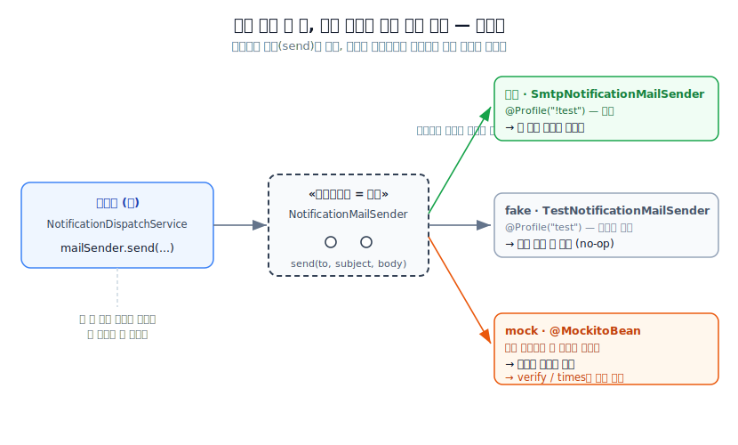

# [2] 테스트더블 / `@MockitoBean` · 03 갈아끼우기를 가능케 한 구조

〈02〉에서 대역 둘을 봤어요. 그런데 한 발 물러서서 물어봐야 할 게 있어요 — **애초에 진짜 발송기 자리에 가짜를 끼워 넣는 게 어떻게 가능하죠?** `NotificationDispatchService`는 발송을 하긴 해야 하는데, 어느 날은 진짜 SMTP, 어느 날은 no-op fake, 테스트에선 mock… 이렇게 그때그때 다른 놈이 그 자리에 서는 게 당연한 일이 아니거든요. 이걸 가능케 하는 세 겹의 구조가 있어요. 이 섹션이 이번 [2]의 **결정적 메커니즘**입니다 — 여기가 흐릿하면 `@MockitoBean`이 "마법처럼 되는 것"으로 남고, 여기가 잡히면 그 뒤는 전부 자연스러워져요.

## 만약 서비스가 발송기를 직접 만들었다면 — 갈아끼울 틈이 없다

먼저 반대 상황을 상상해 봅시다. 서비스가 발송기를 이렇게 **자기 손으로 직접 만들었다면** 어땠을까요?

```java
// 가상의 나쁜 코드 — 실제 우리 코드가 아니에요
public class NotificationDispatchService {
    private final SmtpNotificationMailSender mailSender = new SmtpNotificationMailSender(...); // ✗
    ...
}
```

이러면 발송기가 서비스 안에 **콘크리트로 굳어** 버려요. 테스트에서 "여기만 가짜로 바꾸고 싶다"고 해도 방법이 없어요 — 그 `new`는 서비스 내부에 박혀 있어서, 바깥에서 손댈 틈이 없거든요. 진짜 SMTP가 무조건 실행되고, 아까 〈01〉의 세 문제가 그대로 터집니다.

핵심은 이거예요. **객체가 자기 협력자를 스스로 만들어 쥐면, 바깥에서 그 자리를 바꿀 수 없다.** 테스트 대역이 성립하려면, 먼저 이 "직접 만들어 쥐기"를 끊어야 해요.

## 첫 번째 겹 — 인터페이스: 자리를 '계약'으로만 정의한다

우리 실제 코드는 발송기를 **인터페이스**로 정의해 뒀어요.

`NotificationMailSender.java`
```java
public interface NotificationMailSender {
    void send(String to, String subject, String body);   // ❶
}
```

`❶`은 오직 **계약**만 말해요 — "받는 사람, 제목, 본문을 주면 발송한다." *어떻게* 발송하는지(SMTP인지, 아무것도 안 하는지, 기록만 하는지)는 한 글자도 없어요. 그 계약을 실제로 이행하는 구현은 따로 있죠.

```java
class SmtpNotificationMailSender implements NotificationMailSender { ... }  // 진짜 — SMTP로 발송
class TestNotificationMailSender implements NotificationMailSender { ... }  // fake — 아무것도 안 함
// mock — Mockito가 런타임에 즉석에서 만들어 내는 또 하나의 구현
```

인터페이스가 하는 일은 **"이 계약만 지키면, 누구든 이 자리에 설 수 있다"**고 문을 열어 두는 거예요. 진짜든 fake든 mock이든, `send(to, subject, body)` 계약만 이행하면 자격이 있어요. 대역이 존재할 수 있는 **첫 번째 토대**가 이거예요 — 자리를 특정 구현이 아니라 계약으로 정의했다는 것.

## 두 번째 겹 — 다형성: 호출부는 계약만 알고, 실체는 런타임이 정한다

이제 그 자리를 실제로 쓰는 쪽을 봅시다. `NotificationDispatchService`는 발송기를 **인터페이스 타입**으로 들고 있어요.

`NotificationDispatchService.java`
```java
private final NotificationMailSender mailSender;                    // ❷ — 인터페이스 타입
...
mailSender.send(                                                   // ❸
        notification.getUser().getEmail(), subject(notification), body(notification));
```

`❷`가 결정적이에요. 서비스가 들고 있는 건 `SmtpNotificationMailSender`(구체 타입)가 아니라 `NotificationMailSender`(인터페이스 타입)예요. 그래서 `❸`에서 `mailSender.send(...)`를 부를 때, 서비스는 **지금 그 자리에 선 게 진짜인지 fake인지 mock인지 전혀 몰라요.** 알 필요도 없고요. 그저 계약(`send`)을 부를 뿐이고, **실제로 어느 구현의 `send`가 실행될지는 런타임에 그 자리에 꽂힌 객체가 정합니다.**

이게 **다형성(polymorphism)**이에요. 같은 `mailSender.send(...)` 한 줄이, 꽂힌 객체에 따라 다른 동작을 합니다 —
- 진짜(`Smtp…`)가 꽂혔으면 → SMTP로 메일이 나가고,
- fake(`Test…`)가 꽂혔으면 → 아무 일도 안 일어나고,
- mock이 꽂혔으면 → "불렸다"는 사실이 기록됩니다.

**호출하는 코드는 한 글자도 안 바꿔요.** 바뀌는 건 "그 자리에 누가 서 있느냐"뿐이에요. 이 비대칭이 테스트 대역의 심장이에요 — 프로덕션 코드는 그대로 두고, 협력자만 바꿔치기해서 원하는 검증을 하는 것.

> **물리적 비유.** 벽의 콘센트를 생각해 보세요. 콘센트는 "220V 규격의 플러그면 꽂힌다"는 계약(인터페이스)만 정하죠. 선풍기를 꽂으면 바람이, 전등을 꽂으면 빛이 나와요. 벽(호출부)은 뭐가 꽂혔는지 몰라요 — 그냥 전기를 흘릴 뿐이고, 무슨 일이 일어날지는 꽂힌 기기가 정합니다. `mailSender.send(...)`가 벽이고, 진짜·fake·mock이 갈아 꽂는 기기예요.



위 그림에서 왼쪽 벽(`mailSender.send(...)`)은 셋 중 무엇이 꽂혀도 **똑같은 한 줄**이에요. 바뀌는 건 오른쪽 — 꽂힌 게 진짜냐 fake냐 mock이냐뿐이고, 그에 따라 "메일이 나간다 / 아무 일 없다 / 호출이 기록된다"로 결과가 갈려요. 이 "호출부는 고정, 실체만 교체"가 테스트 대역의 심장이라고 한 게 바로 이 그림이에요.

## 세 번째 겹 — 의존성 주입: 그 '꽂는' 행위를 바깥이 한다

인터페이스로 자리를 열고(1겹), 다형성으로 호출부를 실체와 분리했어요(2겹). 이제 마지막 질문 — **그 자리에 실제로 누구를 꽂는 일은 누가 하죠?** 서비스 자신이 하면 안 돼요(아까 `new`의 함정). 그래서 우리 코드는 발송기를 **생성자로 받습니다.**

`NotificationDispatchService.java`
```java
public NotificationDispatchService(NotificationRepository notificationRepository,
                                   NotificationEventPublisher eventPublisher,
                                   NotificationMailSender mailSender,        // ❹ — 받아온다, 안 만든다
                                   SendIdempotencyGuard idempotencyGuard) {
    ...
    this.mailSender = mailSender;                                           // ❺
}
```

`❹`에서 서비스는 발송기를 **직접 만들지 않고 바깥에서 건네받아요.** 이게 **의존성 주입(Dependency Injection, DI)**이에요 — 객체가 필요로 하는 협력자를, 그 객체 바깥의 누군가가 만들어서 넣어(inject) 주는 것. 여기서 "바깥의 누군가"가 스프링이에요. 스프링은 `❹`의 타입이 `NotificationMailSender`인 걸 보고, **그 타입에 해당하는 빈을 컨텍스트에서 찾아 꽂아 줍니다.**

바로 이 "찾아서 꽂는" 지점에서 갈아끼우기가 벌어져요.
- 운영 프로파일이면 → `@Profile("!test")`인 `SmtpNotificationMailSender`가 그 타입의 빈이라 꽂히고,
- 테스트 프로파일이면 → `@Profile("test")`인 `TestNotificationMailSender`(fake)가 꽂히고,
- 테스트가 `@MockitoBean`으로 그 자리를 지정하면 → 스프링이 **그 빈을 mock으로 덮어써서** 꽂습니다.

서비스는 이 셋 중 무엇이 오는지 몰라요. 그저 생성자로 받은 걸 쓸 뿐이죠. **"누구를 꽂을지"의 결정권이 서비스 안이 아니라 바깥(스프링 + 테스트 설정)에 있다** — 이게 DI가 준 마지막 열쇠예요.

## 세 겹을 한 줄로

정리하면 이래요. **인터페이스**가 자리를 계약으로 열어 두고(누구든 자격을 얻게), **다형성**이 호출부를 실체로부터 떼어 놓고(같은 호출, 다른 동작), **DI**가 그 자리에 누구를 꽂을지의 결정을 바깥으로 빼냈어요(테스트가 대역을 꽂을 수 있게). 이 셋이 함께 있어야 비로소 "프로덕션 코드는 그대로, 협력자만 가짜로" 바꾸는 게 가능해집니다. 하나라도 없으면 무너져요 — `new`로 직접 만들면 DI가 없어 못 바꾸고, 구체 타입으로 들고 있으면 다형성이 없어 mock을 못 꽂아요.

> **앞서 도출한 것과 잇기.** "영속성 계층이 외부 통신 세부를 감추는 패턴을, 메일·캐시·메시지 발행 같은 DB 밖 외부 시스템으로 일반화할 수 있다" — 이 일반화를 이미 잡았다면, `NotificationMailSender`를 인터페이스로 둔 게 정확히 그것이죠. 그때 본 값은 "운영 세부(SMTP)를 감춘다"였는데, **오늘 그 인터페이스가 값을 하나 더 내놓은 거예요 — 바로 지금 이 테스트 대역 가능성(testability).** 운영 구현을 감추려고 그은 그 경계가, 그대로 테스트에서 가짜를 꽂는 문이 됐어요. 좋은 경계는 이렇게 의도하지 않은 곳에서까지 값을 돌려줍니다.

이제 구조가 잡혔으니, 그 문으로 실제로 대역들이 어떻게 들어오는지 볼 차례예요. 먼저 조용한 쪽 — 〈04 `TestNotificationMailSender`〉, 이 no-op fake가 *왜 굳이 존재해야 했는지*(사실 여기엔 당신이 예상 못 한 이유가 있어요)를 풀고, 그다음 〈05〉에서 주인공 `@MockitoBean`으로 갑니다.
